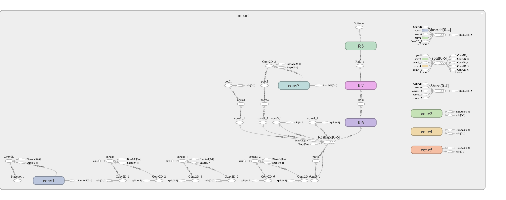
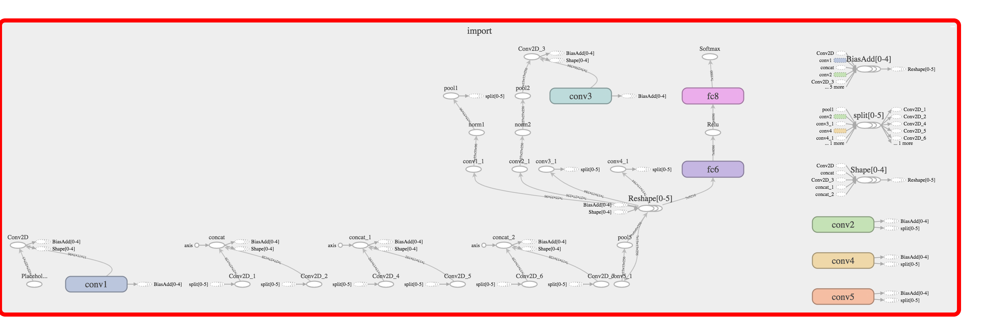

# Intro

This is a simple tool to:

- [X] Inspect tensorflow frozen graph

- [X] Tailor tensorflow frozen graph in configurable way


*Star it if it is useful!*

# Why tailor frozen graph?

Tensorflow is indeed a amazing fast, easy and cross-platform framework. Deploying tensorflow trained model
in format of single protobuf file is also really friendly.

However, you may meet following cases that you really want to do some hacking on the tensorflow frozen graph:

- [X] Some operators in the frozen graph are not supported in other platform, I want to deleted or modify them

- [X] During the freezing process, some nodes were accidentally included while useless at all

- [X] I am doing some research and I only want to keep part of the graph and maybe replace some node as a placeholder

- [X] ... 

Therefore, in here, I provide several tools to achieve that case. Below is a simple example to show:

- [X] How to inspect a frozen graph

- [X] How to delete a layer

- [X] How to save as a new frozen graph

# Example Usage

#### 0. Summary

Assume you want to use a Pre-trained AlexNet model.
However, you want to remove some layers/nodes in the frozen graph so that your can customize it to your use-case. 
Here, we give an example on how you do it properly, with an example of removing `fc7` layer.


#### 1. Download Example Frozen graph

```
bash ./download_example.sh
```

You will see a frozen AlexNet model has been downloaded under `example` folder.

#### 2. Visualize Frozen Graph in Tensorboard


##### 2.1 First Export PB file to TF Events

```
# Below works on MacOS and in Ubuntu you may want to use different syntax for $(pwd)
python import_pb_to_tensorboard.py --model_dir=$(pwd)/example/alexnet_frozen.pb  --log_dir=$(pwd)/log/raw/
```

##### 2.2 Visualize it

```
tensorboard --logdir=$(pwd)/log/
```

Then visualize it at `localhost:6006`



#### 3. Example Tailor

##### 3.1 Understand what's going on


As we mentioned, we want to remove `fc7` layer entirely.

By running 

```
python export_pb_connections.py --graph_dir=$(pwd)/example/alexnet_frozen.pb
```

A text file containing how nodes are connected has been exported in `example/alexnet_frozen.pb.txt`.

You will get more detailed information on how they get connected:

```
81 fc7/weights Const
82 fc7/weights/read Identity
  |-------0 fc7/weights
83 fc7/biases Const
84 fc7/biases/read Identity
  |-------0 fc7/biases
85 fc7/fc7/MatMul MatMul
  |-------0 Relu
  |-------1 fc7/weights/read
86 fc7/fc7 BiasAdd
  |-------0 fc7/fc7/MatMul
  |-------1 fc7/biases/read
87 Relu_1 Relu
  |-------0 fc7/fc7
```

```
88 fc8/weights Const
89 fc8/weights/read Identity
  |-------0 fc8/weights
90 fc8/biases Const
91 fc8/biases/read Identity
  |-------0 fc8/biases
92 fc8/fc8/MatMul MatMul
  |-------0 Relu_1
  |-------1 fc8/weights/read
93 fc8/fc8 BiasAdd
  |-------0 fc8/fc8/MatMul
  |-------1 fc8/biases/read
94 Softmax Softmax
  |-------0 fc8/fc8
```

So, in node language:

node[85].input[0] (`Relu`) --> `fc7/` --> node[87] (`Relu_1`) == node[92].input[0] (`Relu_1`) --> `fc8/`

##### 3.2 Surgery Prepare

Therefore to remove fc7, what we need to do are:

* Swap input of fc8 from `Relu_1` to `Relu` (since they have the same shape, we shall be good)

* Reindex the graphs to ignore `fc7` nodes

* Delete `Relu_1`

Namely, tailor:

node[85].input[0] (`Relu`) --> `fc7/` --> node[87] (`Relu_1`) == node[92].input[0] (`Relu_1`) --> `fc8/`

to:

node[85].input[0] (`Relu`) --> `fc8/`

##### 3.3 Surgery

Run:


```
python tailor.py
```

Then visualize it on tensorboard again:

```
python import_pb_to_tensorboard.py --model_dir=$(pwd)/example/alexnet_frozen_tailored.pb  --log_dir=$(pwd)/log/
```

You will see:




Check the detailed connection again to see those `fc7` layers are gone:

```
python export_pb_connections.py --graph_dir=$(pwd)/example/alexnet_frozen_tailored.pb
```

#### 4. Compare

```
python compare.py
```

You will see the original AlexNet predict the `Zebra` correctly while tailored one not, which is expected.


# How to use this tool further?

As you may see, I have not make this a super generic tool so that you can use a configuration file or arguments to pass
simple index, or node names to make the task as a black box. That's because there's really no simple way to do it without understanding
what's going on in the frozen graph indeed.

Therefore, if you really need a generic way, here's the recipe:

* Test your original Frozen Graph to ensure you have a test-suite to compare with

* Understand which layer you want to remove, and why 
(some operators not supported by another platform such as TensorRT, Movidius, or Raspberry Pi or you need to do some hack)

* Visualize the frozen graph with tensorboard with `import_pb_to_tensorboard.py`

* Roughly understand which layer you want to remove and which nodes you want tou delete

* Check the dimension matching and dtype matching (you cannot re-connect a 1024 tensor with a 4096 one right?)

* Get the index with `export_pb_connections.py`

* Now, write your own `tailor.py`

* Then write a test-suite, inferencing the same input with original frozen graph and tailored one to see whether the results are expected 
(in our example case, the results are expected to be different. However if you just need to remove such as Dropout operators or
other redundant nodes, you shall expect the same one)

* Ta Da!